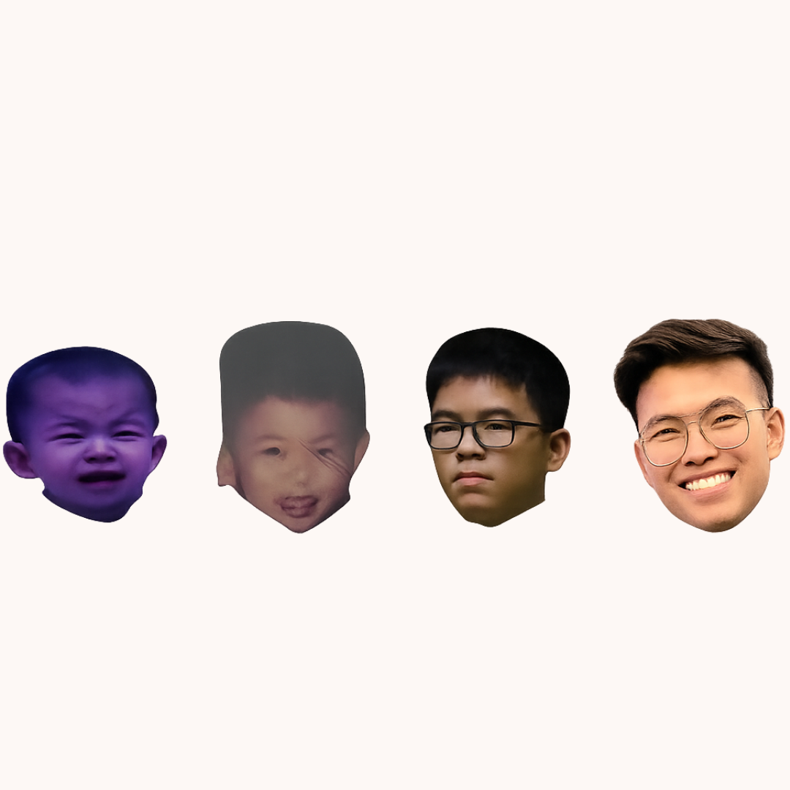

<html lang="en">
<head>
  <meta charset="UTF-8" />
  <title>Happy Birthday ♡</title>
  <meta name="viewport" content="width=device-width, initial-scale=1" />
  <!-- Google Fonts -->
  <link href="https://fonts.googleapis.com/css2?family=Playfair+Display:wght@500;700&family=Inter:wght@300;400;500;600&family=Press+Start+2P&family=VT323&display=swap" rel="stylesheet" />

  
</head>
<body>

<!-- Optional GIF overlay -->

<main>
  <!-- LANDING SCREEN -->
  <section class="landing" id="landing">
    

      🌙 softly dedicated to <strong>My Favourite Person</strong>
    

    <!-- evolution image (replace filename if needed) -->
    

    <h1 class="pixel-title">Happy 25th Birthday Baby Teo</h1>

    

      Are you ready to receive your birthday present?
    

    

      <button class="start-btn" id="startBtn">Start ▶</button>
    

  </section>

  <!-- STORY SECTION (hidden until Start) -->
  <section class="section" id="storySection">
    <article class="card show" id="card">
      

        
Page 1 · The Start

        
1 / 6

      

      

    </article>

    

      <button class="btn" id="prevBtn" disabled>← Back</button>
      
Page 1 of 6

      <button class="btn" id="nextBtn">Next →</button>
    

  </section>
</main>

<!-- Confetti (JS) -->

</body>
</html>
